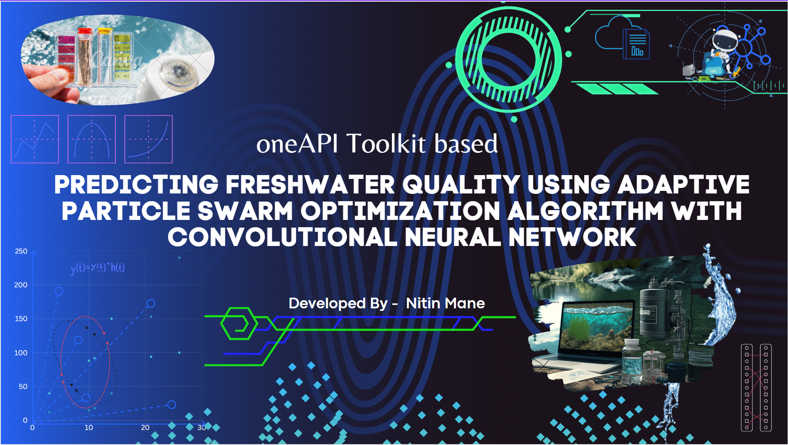

# Freshwater Quality Prediction using oneAPI

[](https://www.python.org/downloads/release/python-380/)
[](https://www.anaconda.com/)
[](https://software.intel.com/en-us/oneapi)
[](https://scikit-learn.org/stable/install.html)
[](https://software.intel.com/en-us/oneapi-onedal-library)
[](https://software.intel.com/en-us/daal4py)



This project aims to improve the accuracy and efficiency of freshwater quality prediction using the Adaptive Particle Swarm Optimization (APSO) algorithm with a Convolutional Neural Network (CNN).

Objectives
To use the APSO algorithm to optimize the parameters of the CNN model for freshwater quality prediction.
To train the CNN model on a dataset of freshwater quality measurements and satellite imagery.
To evaluate the performance of the model using metrics such as accuracy, precision, and recall.
To deploy the model in real-world scenarios and use it to predict the quality of freshwater in different locations.
To use the oneAPI toolkit and the oneDNN library to develop and run the model on a variety of hardware platforms, such as CPUs, GPUs, and other accelerators.
Getting Started
Prerequisites
Python 3.7 or later
TensorFlow 2.4 or later
oneAPI Base Toolkit
oneDNN library

Installation

Clone the repository:


Copy code
```
git clone https://github.com/Nitin-Mane/Automated-Weed-Detection.git
```
then go the directory
```
cd Freshwater-Quality-Prediction-using-oneAPI
```
Install the required packages:

```
pip install -r requirements.txt
```
Prepare the dataset:

Download from the hackathon theme info
```
!wget <dataset file link>
```

The dataset should be in the data folder.
The dataset should be in CSV format, with the first column representing the quality of freshwater, and the remaining columns representing the satellite imagery data.
Train the model:

Follow the notebook file: [Baseline](./Baseline.ipynb)

After the data is processed then follow notebook file: [Machine-Learning](./Machine%20Learning%20Modelling.ipynb)


License
This project is licensed under the MIT License. See the LICENSE file for details.
